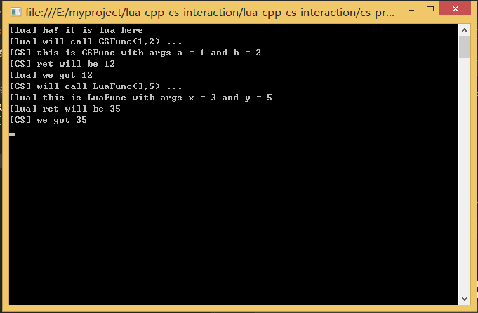

1. lua库
  lua-5.1.5_Win64_vc11_lib
  http://luabinaries.sourceforge.net/

2. 调用lua的cpp动态库
  cpp-dll
  VS2012
  x64

3. cs工程
  cs-proj
  VS2012

详情参考[这里](https://aillieo.cn/post/2018-09-19-lua-cpp-cs-integrating/) 。

